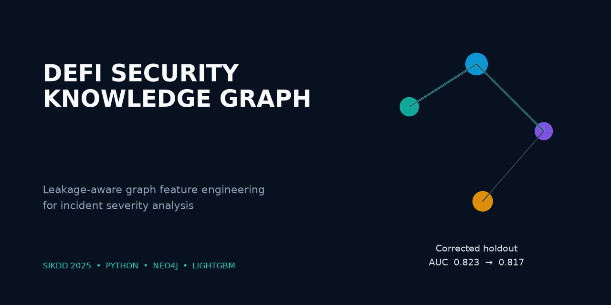
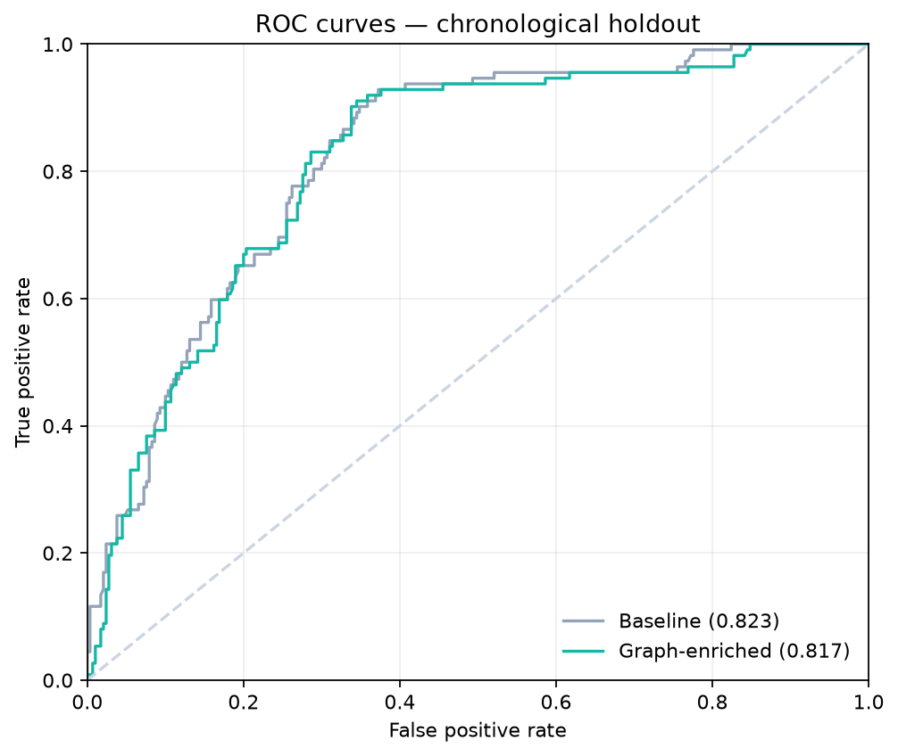
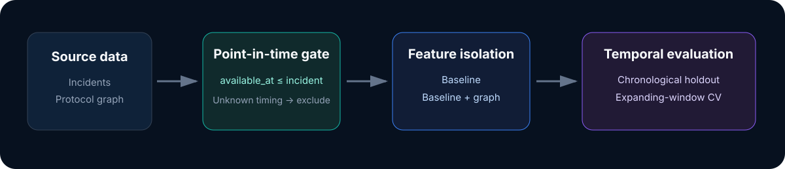

<p align="center">
  
</p>

# DeFi Security Knowledge Graph

[](https://github.com/dariapavlova02/defi-security-knowledge-graph/actions/workflows/ci.yml)
[](https://www.python.org/)
[](LICENSE)
[](https://doi.org/10.70314/is.2025.sikdd.6)

A leakage-aware re-evaluation of graph-derived context for DeFi security incident severity.
The project combines incident records, protocol relationships, point-in-time feature engineering,
and gradient-boosted models while keeping reported conference results separate from a corrected,
reproducible portfolio evaluation.

## Why this repository is different

The 2025 conference paper reported a substantial benefit from semantic graph features. A later
reproducibility audit found that three structural graph features did not carry timestamps proving
they were known before each incident. The portfolio profile therefore excludes them and reruns the
experiment with a chronological split, a training-only severity threshold, and temporal
cross-validation.

The corrected result is less flattering, but more useful: one timestamp-safe graph feature improves
mean temporal-CV AUC slightly, while it does not improve the final chronological holdout. This
repository treats that discrepancy as a result rather than hiding it.

## Results

### Corrected portfolio evaluation

Dataset: 1,608 incidents from 2011–2025. Train/test split date: 2023-07-28. The only eligible graph
feature is the count of strictly earlier incidents for the same protocol.

<!-- portfolio-metrics:start -->
| Model | Holdout AUC | F1 | Precision | Recall | Temporal CV AUC |
|---|---:|---:|---:|---:|---:|
| Baseline | 0.823 | 0.545 | 0.611 | 0.491 | 0.775 ± 0.090 |
| Graph-enriched | 0.817 | 0.513 | 0.620 | 0.438 | 0.787 ± 0.074 |
<!-- portfolio-metrics:end -->

At the primary 75th-percentile threshold, graph enrichment changes holdout AUC by **−0.774%**.
Threshold sensitivity is mixed: `+0.232%` at the 70th percentile, `−0.774%` at the 75th, and
`−0.929%` at the 80th. Machine-readable evidence is committed in
[`artifacts/portfolio/metrics.json`](artifacts/portfolio/metrics.json) and
[`artifacts/portfolio/robustness.json`](artifacts/portfolio/robustness.json).

<p align="center">
  
  
</p>

### Reported conference result

The paper reported AUC increasing from `0.598` to `0.787` (`+31.6%`) and F1 from `0.384` to
`0.480`. These values are preserved as **reported results**, not presented as the corrected rerun.
See the [official paper](https://aile3.ijs.si/dunja/SiKDD2025/Papers/IS2024_-_SIKDD_2025_paper_6.pdf),
[DOI](https://doi.org/10.70314/is.2025.sikdd.6), and
[`reported_metrics.json`](artifacts/conference/reported_metrics.json).

## Method

<p align="center">
  
</p>

- **Baseline:** year, month, day of week, incident type, target type, and chain.
- **Graph-enriched:** baseline plus graph facts whose `available_at` timestamp is not later than the
  incident date.
- **Target:** loss above the 75th percentile computed from the training period only.
- **Evaluation:** chronological 75/25 holdout and five expanding-window temporal folds.
- **Fail-closed rule:** without timestamped graph facts, the code refuses to make predictive claims.

The complete protocol and limitations are documented in [Methodology](docs/METHODOLOGY.md).

## Quick start

```bash
git clone https://github.com/dariapavlova02/defi-security-knowledge-graph.git
cd defi-security-knowledge-graph
uv sync --all-extras
make demo
```

`make demo` uses a clearly labelled synthetic fixture and requires neither credentials nor Neo4j.
It writes `metrics.json`, `run_metadata.json`, and two figures to `artifacts/demo/`.

To prepare a private source export and run the corrected experiment:

```bash
uv run python -m defi_security data build --input /path/to/incidents.json
make reproduce
```

See [Data](docs/DATA.md) for the schema and provenance policy and
[Reproducibility](docs/REPRODUCIBILITY.md) for all profiles and commands.

## Engineering highlights

- Installable `src/` package with one CLI for data preparation, experiments, and Neo4j loading.
- Deterministic LightGBM pipeline with isolated baseline and graph feature sets.
- Point-in-time availability gate and chronological validation.
- Idempotent async Neo4j upserts with no default credentials.
- Ruff, pytest, 80% coverage gate, dependency audit, and CI on Python 3.11 and 3.12.
- Data provenance manifest and fail-closed redistribution policy.

## Repository map

```text
src/defi_security/       reusable data, modeling, reporting, and Neo4j code
data/sample/             explicit synthetic fixture for smoke tests
artifacts/               selected machine-readable research evidence
docs/                    methodology, data policy, and reproduction guide
tests/                   unit, integration, and regression tests
scripts/                 deterministic fixture and portfolio-asset generators
```

## Research context

This repository accompanies **Graph-Based Feature Engineering for DeFi Security Incident Severity
Prediction**, presented at Slovenian KDD / Information Society 2025 by Daria Pavlova, Inna Novalija,
and Dunja Mladenić.

The software is a research artifact, not a deployed risk-scoring or financial decision system.
Public incident reporting is incomplete, loss values are noisy, and point-in-time protocol metadata
remains the principal limitation.

## Citation

```bibtex
@inproceedings{pavlova2025defi,
  title={Graph-Based Feature Engineering for DeFi Security Incident Severity Prediction},
  author={Pavlova, Daria and Novalija, Inna and Mladeni{\'c}, Dunja},
  booktitle={Information Society 2025: Slovenian KDD Conference},
  year={2025},
  doi={10.70314/is.2025.sikdd.6}
}
```

Software: Daria Pavlova. Paper: Daria Pavlova, Inna Novalija, and Dunja Mladenić.
Released under the [MIT License](LICENSE).
