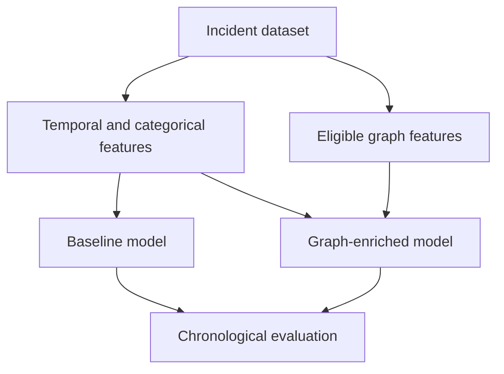
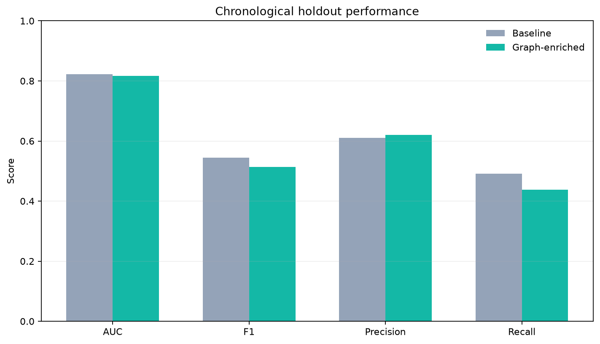

# DeFi Security Knowledge Graph

[](https://github.com/dariapavlova02/defi-security-knowledge-graph/actions/workflows/ci.yml)
[](https://www.python.org/)
[](LICENSE)

Evaluates whether graph-derived protocol context improves DeFi incident severity classification.
Compares baseline and graph-enriched LightGBM models using chronological validation.

[Paper](https://doi.org/10.70314/is.2025.sikdd.6) ·
[Methodology](docs/METHODOLOGY.md) · [Reproduce](docs/REPRODUCIBILITY.md) · [Data](docs/DATA.md)

## Quick start

Requires Python 3.11–3.12 and [uv](https://docs.astral.sh/uv/getting-started/installation/).

```bash
git clone https://github.com/dariapavlova02/defi-security-knowledge-graph.git
cd defi-security-knowledge-graph
uv sync --all-extras --locked
make demo
```

The demo uses an explicitly synthetic test fixture and needs no credentials or Neo4j.
Outputs are saved to `artifacts/demo/`; demo metrics are not research results.
For the real-data rerun and optional Neo4j setup, see [Reproducibility](docs/REPRODUCIBILITY.md).

## How it works



- Both models use the same LightGBM configuration and baseline inputs.
- Graph features require an `available_at` timestamp no later than the incident timestamp.
- Severe loss is defined by the training-period 75th percentile.
- Evaluation uses a chronological holdout and five expanding-window validation folds.

Neo4j is optional for the model rerun. See [Methodology](docs/METHODOLOGY.md) for feature definitions
and [Data](docs/DATA.md) for the input schema and provenance policy.

## Results

### Corrected portfolio evaluation

Dataset: 1,608 incidents from 2011–2025. Train/test split date: 2023-07-28. The only eligible graph
feature is the count of strictly earlier incidents for the same protocol.

<!-- portfolio-metrics:start -->
| Model | Holdout AUC | F1 | Precision | Recall | Temporal CV AUC |
|---|---:|---:|---:|---:|---:|
| Baseline | 0.823 | 0.545 | 0.611 | 0.491 | 0.775 ± 0.090 |
| Graph-enriched | 0.817 | 0.513 | 0.620 | 0.438 | 0.787 ± 0.074 |
<!-- portfolio-metrics:end -->

Graph enrichment did not improve the chronological holdout: AUC changed by `−0.774%`.
Mean temporal-CV AUC was slightly higher, but the result was not consistent across evaluations.
See the committed [metrics](artifacts/portfolio/metrics.json),
[threshold sensitivity](artifacts/portfolio/robustness.json), and
[additional evaluation figure](docs/METHODOLOGY.md#evaluation-figure).



### Reported conference result

The paper reported AUC increasing from `0.598` to `0.787` (`+31.6%`) and F1 from `0.384` to
`0.480`. These values are preserved as **reported results**, not presented as the corrected rerun.
See the [paper](https://aile3.ijs.si/dunja/SiKDD2025/Papers/IS2024_-_SIKDD_2025_paper_6.pdf) and
[reported metrics](artifacts/conference/reported_metrics.json).

## Limitations

- Three structural graph features are excluded from the corrected evaluation because their
  historical availability is undocumented. The rerun does not evaluate the full original graph.
- Public incident coverage is incomplete and reported losses can be noisy or revised.
- Raw source records are not redistributed: rights have not been established. Reproducing the
  full experiment requires a separately obtained source export.
- This is a research artifact, not a deployed risk-scoring or financial decision system.

## References

This repository accompanies **Graph-Based Feature Engineering for DeFi Security Incident Severity
Prediction**, presented at Slovenian KDD / Information Society 2025 by Daria Pavlova, Inna Novalija,
and Dunja Mladenić.

DOI: [10.70314/is.2025.sikdd.6](https://doi.org/10.70314/is.2025.sikdd.6).
Machine-readable citation: [CITATION.cff](CITATION.cff).

<details>
<summary>BibTeX</summary>

```bibtex
@inproceedings{pavlova2025defi,
  title={Graph-Based Feature Engineering for DeFi Security Incident Severity Prediction},
  author={Pavlova, Daria and Novalija, Inna and Mladeni{\'c}, Dunja},
  booktitle={Information Society 2025: Slovenian KDD Conference},
  year={2025},
  doi={10.70314/is.2025.sikdd.6}
}
```

</details>

Software: Daria Pavlova. Paper: Daria Pavlova, Inna Novalija, and Dunja Mladenić.
Released under the [MIT License](LICENSE).
